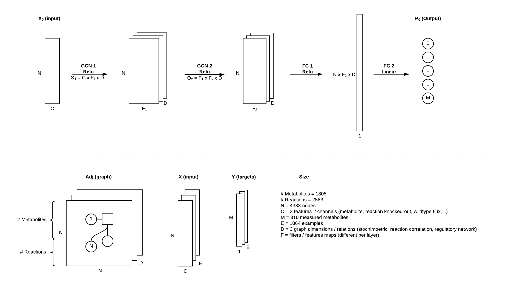

# Suggestions for future work

## Overview
* Continuous target (regression) instead of classification
* Predict up or down regulated vs. significantly changed
* Experiments with different network architectures
* Compare performance of graph convolutional layers vs small fully connected network
* Generate training data single & double gene knockouts with a kinetic model
* Add Protein interaction network as a new dimension to the graph (adj matrix)
* Group metabolites to create fewer classes to predict
* Turn around input and target (predict gene knockouts from metabolite concentrations)
* Propagate signals per graph (not take weighted sum per layer). So you get the increasing receptive field for layers individually
* Use Pytorch implementation based on Kipf implementation (adapted for multi dimensional adjacency matrices) --> See code in this repo
* Compare predictions of Kristian to concentration before discretizing/binarizing the target variable
* Once it works well integrate graph machine learning into caffeine dddecaf

## Generating data with kinetic models

Citing marta Matos:
"There are 3 models that should be decent these days:
1. https://journals.plos.org/ploscompbiol/article?id=10.1371/journal.pcbi.1005396
2. https://www.sciencedirect.com/science/article/pii/S1389172317306497
3. https://www.nature.com/articles/ncomms13806

Models 2 and 3 are in matlab and i hear they are tricky to deal with

Model 3 should be pretty good though, as far as i remember the authors claim it can predict the impact of gene knockouts.

model 1 is in sbml and is straightforward to load on copasi (http://copasi.org/) and play with. in principle you can also use tellurium (http://tellurium.analogmachine.org/) or the mass toolbox (http://opencobra.github.io/MASS-Toolbox/) to play it with it, and i'm sure there are other software packages that you can use.
just one thing, if you go for anything other than copasi, do one simulation on copasi and repeat it in your chosen software to make sure the results match. i've seen weird results on tellurium and mass toolbox because the model wasn't imported correctly."

Matlab code for model 3 is included in the repo.

# Useful background info

## Very useful youtube videos
* Intro to Graph Convolutional Networks
https://www.youtube.com/watch?v=UAwrDY_Bcdc&t=2462s
* Generalizing Convolutions for Deep Learning
https://www.youtube.com/watch?v=0_O8PdZBc5s
* Xavier Bresson: "Convolutional Neural Networks on Graphs"
https://www.youtube.com/watch?v=v3jZRkvIOIM
* Graph neural networks: Variations and applications
https://www.youtube.com/watch?v=cWIeTMklzNg&t=195s
* Steve Purves - Graph Convolutional Networks for Node Classification
https://www.youtube.com/watch?v=LFSR27BaNIQ&t=276s

## Papers
* https://www.groundai.com/project/hypergraph-neural-networks/
* https://link.springer.com/chapter/10.1007%2F978-3-319-93417-4_38
* http://science.sciencemag.org/content/362/6416/eaat8603
* https://arxiv.org/pdf/1703.06103.pdf
* https://www.sciencedirect.com/science/article/pii/S0010482518304086?dgcid=author

## Code resources
* Intuitive to use library for graph based models & deep learning https://docs.dgl.ai/index.html 
* Kipf pytorch implementation https://github.com/tkipf/pygcn
* Kipf tensorflow implementation https://github.com/tkipf/gcn

## Network architecture image
Source file on lucid chart is available in biosustain domain.

